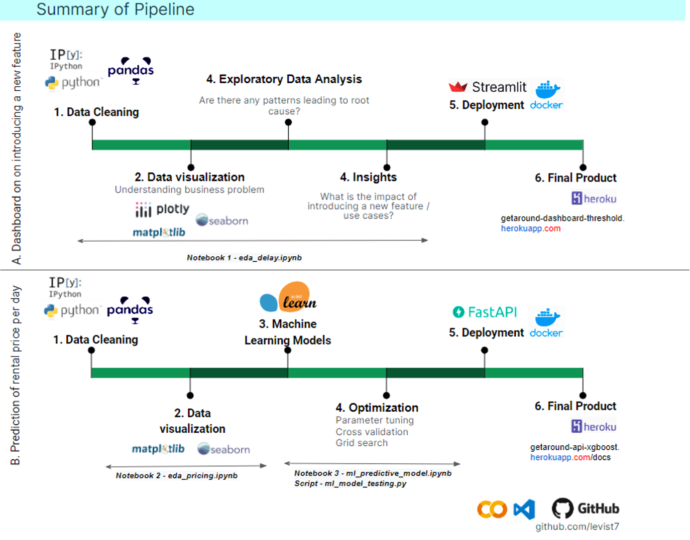

# GetAround Project on Exploratory Data Analysis, Supervised Machine Learning, Dashboard and API Build

  

Link to [dashboard](http://getaround-dashboard-threshold.herokuapp.com)

Links to [API/docs](http://getaround-api-xgboost.herokuapp.com/docs) and [API/predict](http://getaround-api-xgboost.herokuapp.com/predict)  

[Video presentation](https://share.vidyard.com/watch/nC4tkmkVYyy2V9Rg9QzRua?)  

## Table of contents
* [Project](#project)
* [Pipeline](#pipeline)
* [Deliverables](#deliverables)
* [Model performances](#modelperformances)
* [Technologies](#technologies)
* [Getting Started](#getting-started)
* [License](#license)
* [Author](#author)

## Project  
Getaround is an online rental car rental service in an Airbnb way. When renting a car, users have to complete a checkin flow at the beginning of the rental and a checkout flow at the end of the rental in order to:

*  Assess the state of the car and notify other parties of pre-existing damages or damages that occurred during the rental.
*  Compare fuel levels.
*  Measure how many kilometers were driven.
*  Ensure checkin and checkout policies

**First goal** is to resolve those issues and give insights on implementing a minimum delay between two rentals. A car won’t be displayed in the search results if the requested checkin or checkout times are too close from an already booked rental. It can solve the late checkout issue but may hurt Getaround/owners' revenues.

**Second goal** is to provide an online API on Heroku server containing /predict endpoint that estimates the rental price per day.

## Pipeline  



## Deliverables  

Availabe deliverables 📬:  

1-  Exploratory data analysis on Getaround data and test of various machine learning models  
2-  A dashboard in production. [Dashboard](http://getaround-dashboard-threshold.herokuapp.com)  
3-  A documented online API [API/docs](http://getaround-api-xgboost.herokuapp.com/docs) containing /predict endpoint that respect the technical descriptions.  

## Model performances

Machine learning model performances are summarized below:  


Please note that the results show the box plots of metrics obtained with cross-validation and K=4-fold attributions.    
In this project, the best performances were obtained by **XGboost regressor model** (experiment number 13). Therefore, it was taken into consideration to deploy together with the web API. The error metric is listed below:
* RMSE = 12.8 dollars on predicting car rental prices per day (mean of 4-fold scores)

*More details can be found under 'tracking' folder.*

## Technologies

Project is created with:
* Python 3.8
* Jupyter Notebook 6.4.12
* Python libraries (see /requirements.txt)
* VSCode 1.71.2
* Docker for containers

or this github project can be launched on [colab-google](https://colab.research.google.com) without any local installations. It is free and requires Google account sign-in.  

## Getting Started

To run this project, 
1. Clone the repo:
   ```sh
   git clone https://github.com/levist7/GetAround_EDA_ML_Dashboard_API_Project.git
   ```
2. Install [packages](#technologies)

3. Install python libraries
   ```sh
   pip3 install -r requirements.txt
   ```

## License

Distributed under the MIT License. See LICENSE.txt for more information.

## Author  

* [levist7](https://github.com/levist7)  
---
Made with ❤️ in Paris
---
